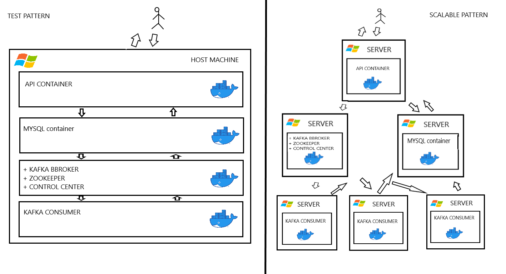

# PictureResizeApi
***
### Technical Design Assignment

PcitureResizeApi creates an API for picture resizing that is asynchronous. It does this by using a RESTful API concepts and horizontal distribution and scaling systems. This ensure that every element of the app can run simultaneously on multiple different servers or on one single machine at any given time. The essentially allows for the system to produce its other main goal of creating a playback system of different models in Event-Driven Architecture.

In laymen’s terms and for purposes of the app though, this all means that when a user uses the the app all requests to the API will have their own ID number and user can get the status of an operation by using this ID number or by typing in the result of the operation into the API. When one wants to know what a particular operation did to a photo, this is useful. 
***
### How to Make a Request

A request for resizing a picture should be made into to the API containing the request “POST” and have in the body of the request the following json attributes: {“image”:{base64 encoded picture},”width”:{w}, ”height”:{h}}.

Once this above operation is completed, the user should retrieve his resized picture by sending a GET request to the API with the ID number in url (api/<id>).

Every part of the application should run through separate Docker containers.

***
### Main Elements

* DB: A basic MySQL database that runs in real time with the setup of the application. It has just one user and one table. The database is configured via the interface adminer by running MySQL scripts directly in a browser.

* Kafka: Consists of zookeper, kafka brockers and control-center.

* API: API is the application programing interface. It's bult on Flask framework and uses two different URL’s for processing requests and feedback. Additional url returns a template with java-script, which helps to encode the picture and send json request to the api.

* Kafka-Consumer: This service processes the changes in Kafka topics. Once changes are made they are registered through this app, the pictures are resized, and then they are saved to the DB database.

***
### MAP

***
### REQUIREMENTS
1. 6GB RAM
2. docker
***
### INSTALLATION
run install.ps1